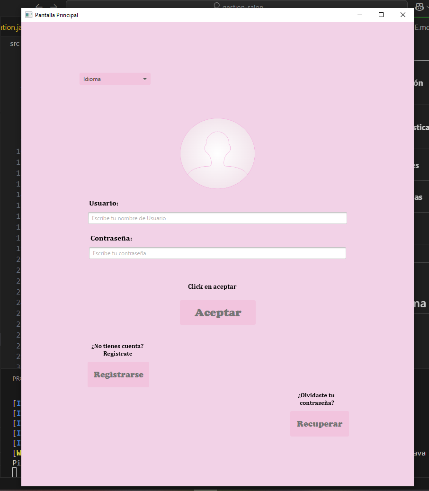

# ✨ ¡Hola, Bienvenido! ✨

¡Este es mi primer proyecto! Soy un entusiasta estudiante de **primer año** en **Diseño de Aplicaciones Multiplataforma (DAM)**.

Este proyecto marca el inicio de mi emocionante viaje en el desarrollo de software. Cada línea de código aquí es un paso de aprendizaje, una exploración de ideas y la cristalización de conceptos que estoy absorbiendo en mi formación.

Soy alguien que cree en el poder de la tecnología para crear soluciones innovadoras y estoy ansiosa por lo que el futuro me depara en el mundo del desarrollo de apps y aplicar lo que aprendo para construir cosas geniales. Aunque este sea mi primer proyecto, está lleno de dedicación, curiosidad y un gran deseo de aprender y crecer.

Explora, experimenta y siéntete libre de darme tu feedback. Estoy abierta a nuevas ideas y siempre buscando mejorar.

¡Gracias por visitar!

🚀 ¡A codificar y a crear! 🚀

# gestion-salon
Aplicación de reserva para un salón de belleza:
La app permitiría a las clientas agendar citas de manera fácil, consultar la disponibilidad de servicios y gestionar sus reservas. Incluiría un sistema de gestión de stock de productos para asegurar que siempre haya disponibilidad de lo necesario. Además, tendría tres roles: un acceso de administrador para la gerente, quien podrá gestionar usuarios y ver estadísticas; un acceso para los empleados, que podrán crear y modificar citas; y una interfaz para las clientas donde podrán ver, modificar o cancelar sus reservas.

# Casos de Uso
## Casos de uso para Administrador (Gerente)

- Actor: Administrador (Gerente)

1. Gestionar usuarios

2. Ver estadísticas

3. Gestionar productos

### - Gestionar usuarios:

- Crear, modificar y eliminar usuarios (empleados y clientas).

- Asignar permisos y roles (empleados o administradores).

### - Ver estadísticas:

- Consultar estadísticas de citas, ventas, productos vendidos y otros datos relevantes.

- Generar reportes sobre las actividades del salón.

### - Gestionar productos:

- Añadir, eliminar o modificar productos del stock (productos para los servicios y productos de venta al público).

- Consultar disponibilidad de productos en tiempo real.

## Casos de uso para Empleado

- Actor: Empleado

1. Gestionar citas

2. Consultar disponibilidad de servicios

3. Gestionar productos

### - Gestionar citas:

- Crear nuevas citas para clientas.

- Modificar citas existentes (hora, servicios, productos asociados).

- Cancelar citas previas.

 ### - Consultar disponibilidad de servicios:

- Ver la disponibilidad de los distintos servicios que ofrece el salón.

- Consultar la disponibilidad de los profesionales para asignar citas.

### - Gestionar productos:

- Ver los productos disponibles para los servicios (por ejemplo, tipos de shampoos, tratamientos, etc.).

- Actualizar la cantidad de productos que se utilizan durante las citas.

## Casos de uso para Clienta

- Actor: Clienta

1. Ver disponibilidad de citas

2. Reservar cita

3. Modificar o cancelar cita

4. Consultar historial de citas

5. Gestionar perfil

### - Ver disponibilidad de citas:

- Consultar la disponibilidad para reservar citas según el tipo de servicio.

### - Reservar cita:

- Elegir un servicio y hora disponible.

- Elegir un profesional de belleza si está disponible.

### - Modificar o cancelar cita:

- Modificar la fecha, hora o servicio de la cita.

- Cancelar la cita previamente agendada.

### - Consultar historial de citas:

- Ver citas pasadas y futuras.

### - Gestionar perfil:

- Modificar sus datos personales (nombre, teléfono, correo).

```
             +-------------------------+
             |      Administrador       |
             +-------------------------+
                    |      |
          -----------------          -----------------
        | Gestionar Usuarios |     | Ver Estadísticas |
        |---------------------|    |-------------------|
        | Gestionar Productos  |
        |----------------------|
             |
+-------------------+                  +---------------------+
|      Empleado     |                  |       Clienta        |
+-------------------+                  +---------------------+
        |        |                          |           |       |      
    ----------------        ----------------    --------------------------
   |Gestionar Citas|        |Consultar Disponibilidad|   |reservar Cita|
   |-----------------|      |-----------------------|  |-------------------|
   |Gestionar Productos|     |Modificar/Cancelar Cita |  |Consultar Historial |
   ---------------------     ------------------------|   |Gestionar Perfil    |

```

### Actor: Administrador (Gerente)

| Actor | Administrador (Gerente) |
|---|---|
| **Descripción** | _Gestiona usuarios, visualiza estadísticas y administra productos del salón._ |
| **Características** | _Capacidad para supervisar todas las actividades del salón, controlar el inventario y generar reportes sobre el rendimiento del negocio._ |
| **Relaciones** | _Interacción con empleados para gestionar citas y con clientas para asegurar la disponibilidad de servicios. Conexión directa con la base de datos para informes y estadísticas._ |
| **Referencias** | _Sistema de gestión de usuarios, plataforma de generación de estadísticas de citas y ventas, control de inventario._ |
| **Notas** | _Acceso completo al sistema para la administración general._ |
| **Autor** | _materancode_ |
| **Fecha** | _23-03-2025_ |

---

### Actor: Empleado

| Actor | Empleado |
|---|---|
| **Descripción** | _Gestiona las citas de las clientas, consulta la disponibilidad de los servicios y mantiene el inventario de productos relacionados con los servicios._ |
| **Características** | _Acceso limitado a la gestión de citas y productos. Capacidad para modificar o cancelar citas, así como ver la disponibilidad de los servicios._ |
| **Relaciones** | _Interacción con clientas para agendar citas y con el administrador para consultar el inventario y gestionar productos._ |
| **Referencias** | _Sistema de gestión de citas, plataforma de consulta de disponibilidad de servicios._ |
| **Notas** | _No tiene acceso a la gestión de usuarios ni a la generación de estadísticas._ |
| **Autor** | _materancode_ |
| **Fecha** | _23-03-2025_ |

---

### Actor: Clienta

| Actor | Clienta |
|---|---|
| **Descripción** | _Utiliza la aplicación para consultar la disponibilidad de citas, hacer reservas, modificar o cancelar citas, y gestionar su perfil personal._ |
| **Características** | _Acceso solo a funciones relacionadas con la consulta y modificación de citas, así como la gestión de su información personal._ |
| **Relaciones** | _Interacción con los empleados para reservar citas y con el sistema para gestionar su perfil._ |
| **Referencias** | _Sistema de reserva de citas, plataforma de modificación y cancelación de citas._ |
| **Notas** | _No tiene acceso a ninguna funcionalidad relacionada con la gestión de usuarios ni productos._ |
| **Autor** | _materancode_ |
| **Fecha** | _23-03-2025_ |


## Pantallas principales


### Pantalla login


### Pantalla registro


## Mooks:


📌 **Tecnologías y Archivos Clave Utilizados en el Sistema de Reservas de Hotel:**

| 💻 Tecnología / Archivo | 📄 Descripción |
| :---------------------- | :------------- |
| 🖥️ Java                 | Utilizamos Java como lenguaje principal de programación por su robustez, portabilidad y amplio soporte para aplicaciones de escritorio. Es ideal para sistemas seguros y escalables, como el de reservas hoteleras. |
| 🎨 JavaFX               | Desarrollamos la interfaz gráfica con JavaFX, una librería moderna de Java para construir UIs interactivas y visualmente atractivas. Permite una experiencia fluida e intuitiva para los usuarios al realizar reservas. |
| 🗄️ SQLite3             | Implementamos SQLite3 como base de datos por ser ligera, integrada y sin necesidad de servidor. Es perfecta para aplicaciones de escritorio con necesidades moderadas de almacenamiento, y se integra fácilmente con Java. |
| 🎨 CSS                  | Usamos CSS para estilizar la interfaz JavaFX, logrando una separación clara entre lógica y presentación. Esto mejora la apariencia visual y facilita el mantenimiento del sistema. |
| ⚙️ Maven                | Gestionamos el proyecto con Apache Maven, una herramienta para la automatización de compilación y gestión de dependencias. Ayuda a mantener el orden del proyecto y facilita el uso de librerías externas. |
| 🔁 Maven Wrapper (mvnw) | Incluimos Maven Wrapper para que el proyecto se compile sin necesidad de tener Maven instalado previamente. Esto asegura que todos los desarrolladores usen la misma versión, facilitando la portabilidad y consistencia. |
| 📦 pom.xml              | El archivo `pom.xml` define la estructura del proyecto, sus dependencias, plugins y configuraciones necesarias para que Maven ejecute correctamente el sistema. Es esencial en la automatización y portabilidad del desarrollo. |
| 🌐 GitHub               | Utilizamos GitHub como plataforma de control de versiones y colaboración. Permite trabajar en equipo, gestionar ramas, revisar código con pull requests y llevar un historial limpio del proyecto. |
| 🛡️ .gitignore          | Incluimos un archivo `.gitignore` para excluir archivos innecesarios o generados automáticamente (como `target/`, `.idea/`, etc.), manteniendo el repositorio limpio y profesional. |
| 🤝 CONTRIBUTING.md     | El archivo `CONTRIBUTING.md` proporciona una guía clara para que otros desarrolladores puedan contribuir al proyecto. Incluye pautas de estilo, normas para enviar cambios y cómo reportar errores o sugerencias de mejora. |

Author: materancode 💻